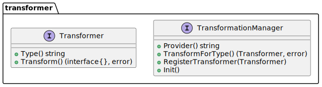

= Transformation

The package `transformation` provides the transformation API which has to be implemented to enable the transformation for the different Terraform providers.

.Class Diagram of the `transformation` package

== Glossary

TransformationManager:: 
    A `TransformationManager` is responsible for all transformations belonging to a specific Terraform provider. 
    He has access to all `Transformer` for the specific _resources_ and _data sources_ of the provider. He provides the entrypoint for the transformation API, all transformations are triggered by the `TransformationManager`.

Transformer::
    A `Transformer` is responsible for the transformation of a specific _resource_ or _data source_ of a Terraform provider. Therefore he contains the specific transformation logic for the _resource_ or _data source_.
    
(Terraform) Provider::
    Terraform relies on plugins called providers to interact with cloud providers, SaaS providers, and other APIs to create the resources necessary to build your infrastructure.

Resource::
    A resource is a piece of infrastructure that is managed by terraform.

Data Source::
    A data source is a piece of infrastructure that is not managed by terraformm, but can be used by Terraform to get information about the infrastructure.